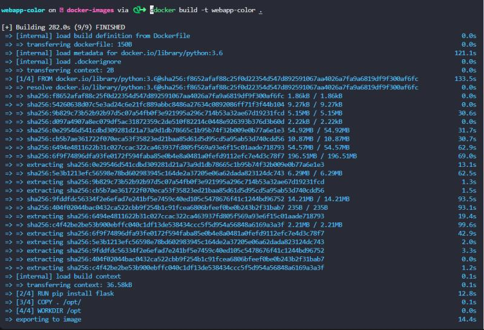
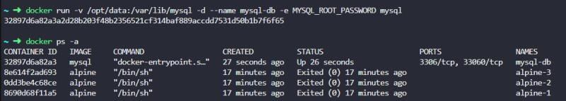

# Docker
Containerized Application Deployment with Docker

## Scope
This project completed the following operational tasks. Screenshots are provided for each task completed, as well as the syntax used and why this task was executed.

## Tasks

### Determine the number of images on the host.

### Determine the version of Docker running on the host.

### Pull images from Docker Hub and confirm now on the host.

### Start the container in the background, validate it is running, stop the container, validated it has stopped.

### Validate containers running on the host, remove them, then validate they are no longer running or on the host.

### Validate images on the the host, remove an image, confirm it is no longer on the host.

### Start a container with the desired name, confirm it is now running on the host.

### Start a container, pull from Docker Hub, map to desired ports, attach "blue" tag to container name.

### Building a smaller image using the lite flag to reduce space used on the host.

### Built my first image.

### Determining the base operating system used by the python image.

### Inspect this Dockerfile prior to containerizing it.

### Run container, send to background and define the ports (-dp).

### Run container of newly built image after mapping ports and sending to the background (-dp), confirm running on the host.

### Inspect container config and determining the defined color.

### Pull the ENVVAR from Docker Hub and set the password, deploy the DB with the defined ENVVAR and database name.

### Launch the container, send to background, set the name, map the ports, define the environment variable, specify the image to use.

### Determine the CMD variable defined in the Docker-wordpress Dockerfile.

### Determine the CMD run when the Ubuntu container is run from the image.

### Determine the ENTRYPOINT from the mysql Dockerfile.

### Run the Ubuntu container in the background and pass the sleep 1000 seconds command to it while launching, validate it isnow up and running.

### Create Dockerfile using compose in YAML.

### Create the container, name it, send to background (-d), specify and name the image used, confirm running.

### Create the container, name it, assign the ports (-p), link to another container and specify the image used.

### Run docker-compose against the YAML file I created, send to the background, then confirm the container is running.

### Stop containers, remove them, then confirm no longer running or present on the host.

### Create a container, name it and assign to the none network.

### Create a container, send to the background (-d), define the password ENVVAR, assign to a network, specify the image to run and confirm it is now running. 

### Define password variable, run container in the background calling defined variable (password), sending to the background (-de), then confirm running.

### Determine networks on the host.

### Determine network details for the container.

### Determine the subnet assigned to the bridge network.

### Run container, map the volume to be used for data storage, send to the background, call the pre-defined ENVVAR, set image used, then confirm running.

### Run container, send to the background, set both ENVVAR, the name and assign ports, assign to network, link to desired container and assign image to be used (-edp). Confirm running after starting.

### Start container: create private registry, send to the background & map ports (-dp), set restart to always, name the registry and map the desired image.

### Prune all containers without an image assigned to them.

### Pull image from Docker Hub, assign desired tags and push to Docker Hub.

### Remove last container from the host, confirm there are not any more running.

